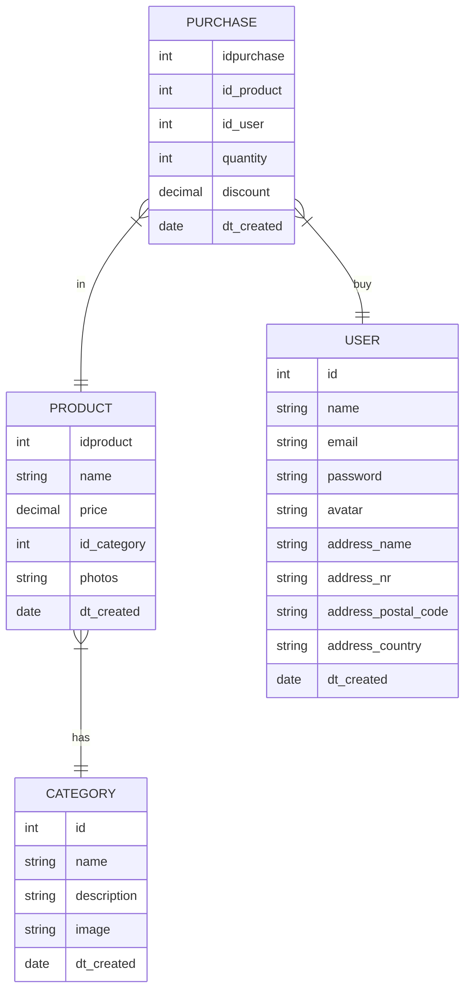

Um sistema de gestão de bases de dados (SGBD) é um sistema fundamental no backend um web site ou aplicação mobile. Ele é o responsável por organizar toda a informação que a aplicação dispobibiliza ou recolhe dos utilizadores. Por exemplo num site que tenha uma montra de produtos, toda a informação sobre os produtos ( nome, cor, preço, ... ) vai estar guardada e organizada num sistema de gestão de bases de dados.

Neste curso vamos o usar o sistema mySQL, mas existe outros que também são muito conhecidos no âmbito do desenvolvimento web, como o postgre ou o mongdb

## Tabelas

Toda a informação num SGDB é organizada e armazenada em tabelas. As tabelas são estruturas (semelhante a uma folha excel) que organizam a informação por colunas, cada uma relativa a uma propriedade da entidade que se está a guardar e cada linha da tabela representa uma entrada da entidade. Nas tabelas é normal também ter uma coluna (id)  que identifica de forma inequívoca uma determinada linha - esta coluna é chamada de chave primária da tabela. Ou seja se eu pesquisar numa tabela de utilizadores por um determinado `id` apenas um utilizador deve ser devolvido, não podem existir dois utilizadores com o mesmo `id`.

Um exemplo, a tabela `user` poderá conter colunas como `id`, `name`, `email`, `password` para guardar as informações dos utilizadores, e cada linha desta tabela representa um utilizador diferente.

Todas as necessidades de informação do site devem ser satisfeitas na DB com a criação das tabelas necessárias. Se temos uma página que apresenta trabalhos de um portfolio, então deveremos ter uma tabela `work`, ou, se temos uma página que apresenta uma lista de produtos, então deveremos ter uma tabela `produto`.

Outro aspecto importante são as relações entre as tabelas, que podem ou não dar origem a outras tabelas. Se temos produtos e utilizadores que podem comprar produtos, necessitamos de uma nova tabela ( a relação de compra ) que guarde os produtos comprados pelos utilizadores. Esta tabela poderia chamar-se `purchase`e deverá ter obrigatoriamente o id do utilizador e o id do produto.
## Modelo loja 

Vamos usar um modelo de dados simplificado de uma loja genérica de produtos.
https://github.com/hjneves/lsd-db-store

O modelo tem as seguintes tabelas:



Neste modelo conseguimos visualizar as relações entre as entidades/tabelas. Podemos verificar que uma categoria pode estar em vários produtos e tanto o produto como o user podem estar em várias compras.
É a designada relação de 1 para N (muitos). 

## Pesquisas de informação

Este é o objetivo final do SGBD, permitir realizar consultas, ou perguntas (queries) às tabelas para disponibilizar conteúdos dinâmicos às páginas web.
Vamos imaginar que um utilizador quer ver uma lista dos produtos disponíveis. O backend terá de pedir ao SGB para realizar uma consulta à tabela de produtos e devolver a informação pretendida.

Existe uma linguagem própria que o SGBD utiliza para realizar estas consultas ( e não só) que se chama Structured Query Language ([SQL](https://www.w3schools.com/sql/sql_intro.asp)) e que se encontra estruturada nos seguintes tipos:

*(DQL) Data Query Language* - permite a consulta de informação às tabelas na base de dados (ex. SELECT).
*(DML) Data Manipulation Language* - permite a alteração e eliminação de dados nas tabelas (ex. INSERT).
*(DDL) Data Definition Language* - permite a criação de tabelas e outros objetos na base de dados (ex. CREATE TABLE).

Por exemplo, se queremos que a lista apresente o nome do produto e o preço, então a query poderia ser:
```sql
select name, price from product;
```

Mas se o utilizador quiser ver todo o detalhe dum determinado produto, então neste caso a query já tinha de ter uma condição de restrição:
```sql
select name, price, categpory_idcategory, photos from product where id = 342;
```
Estamos a pedir toda a informação name, price, ... para o produto com o id 342

Outro tipo de pesquisas podem devolver um conjunto de dados com base em condições de semelhança. Por exemplo, devolver todos os user com email do tipo gmail.
```sql
select name, email from user where email like '%gmail.com'
```
Neste exemplo a condição `like` vai procurar na coluna email, quais o users que têm um email a terminar em `gmail.com`. A `%` indica que o email pode começar com qualquer nome mas tem de terminar com  `gmail.com`. 

Mais exemplos com a utilização do [select](https://www.freecodecamp.org/news/sql-select-statement-and-query-examples/)

## Inserir informação

O termo SQL que permite a inserção de informação numa tabela é o `insert`.
Este tipo de instruções é normalmente usado nas operações de gestão do site em backoffice e nas operações de signup dos novos utilizadores.
Será numa página dedicada de backoffice que serão introduzidos novos produtos por um utilizador com as devidas permissões.

Pegando nosso exemplo, vamos imaginar que é necessário tratar da criação de um novo produto na base dados. No insert tem de ser indicados qual a tabela em que colunas se pretende inserir a informação.
Por exemplo:
```sql
insert into product (name, price, category_idcategory, photos) values ('Template landing page x', 9.99, 1, 'template-lp1.jpg')
```
Estamos a inserir um novo produto como o nome 'Template landing page x' que custa 9.99, pertence à categoria  1 e a sua fotografia está no ficheiro 'template-lp1.jpg'

>[!tip] Nota
>Se a coluna de dados é do tipo string/varchar/text os dados têm ser escritos entre aspas (") ou entre pelicas (')

A situação de signup de um novo utilizador é muito semelhante em termos de estrutura do processo de insert. Vamos imaginar que o utilizador preencheu todos os campos necessários de um form, ao carregar em signup deverá ser efectuado um insert:
```sql
insert into user (name, email, password, avatar, address_name, address_nr, address_postal_code, address_country ) values ('Marco Junior', 'mj@gmail.com', 'ecnrypted-pwd', 'avatar.jpg', 'Rua do Jasmin', '4', '1990-345 Lisboa', 'Portugal')
```

## Eliminar informação

Para eliminar informação da base de dados usamos o `delete`. O delete deverá ser sempre usado com uma cláusula de restrição `where`, caso contrário podemos eliminar todo o conteúdo de uma tabela.
Por exemplo, queremos eliminar o produto com o id 45.
```sql
delete from product where idproduct = 21;
```

>[!tip] Delete
> Se o produto a eliminar estiver a ser usado na tabela `purchase` ele só vai poder ser eliminado se a sua referencia for primeiro eliminada desta tabela. Ou seja, para mantermos informação histórica, não podemos eliminar produtos que tenham sido usados nas compras, a não ser que estas sejam eliminadas primeiro .

## Alterar informação

A alteração de informação de uma determinada tabela é feita com uma expressão `update`.
Temos de indicar qual a tabela e que colunas na tabela são para alterar. Muito importante também aqui, é termos uma cláusula `where` que restrinja as alterações apenas a determinados registos das tabela.

Por exemplo, alteração de preço para o produto 10
```sql
update product set price = 4.99 where idproduct = 10;
```

Ou, por exemplo, alterar o email e a fotografia do utilizador 11
```sql
update user 
set 
	email = 'joao@me.com', 
	avatar =  'joao1.jpg'
where iduser = 10;
```

- Organização da informação em BD - Modelo relacional, tipos de relações -
- Criação de um modelo de dados em mysqlworkbench e mysql
- Criação e Inserção de dados dummy em BD - Queries à BD 
	(clausulas where, order by, group by, joins)
 - Queries à BD - Views - Instruções DML - 
 
 - Briefing exercicio rentcar - Desenho modelo de dados 
 - Caso prático rentcar - Continuação do desenho do modelo de dados - 
 - Criação do script para inserção de dados de teste - 
 - Queries SQL
 