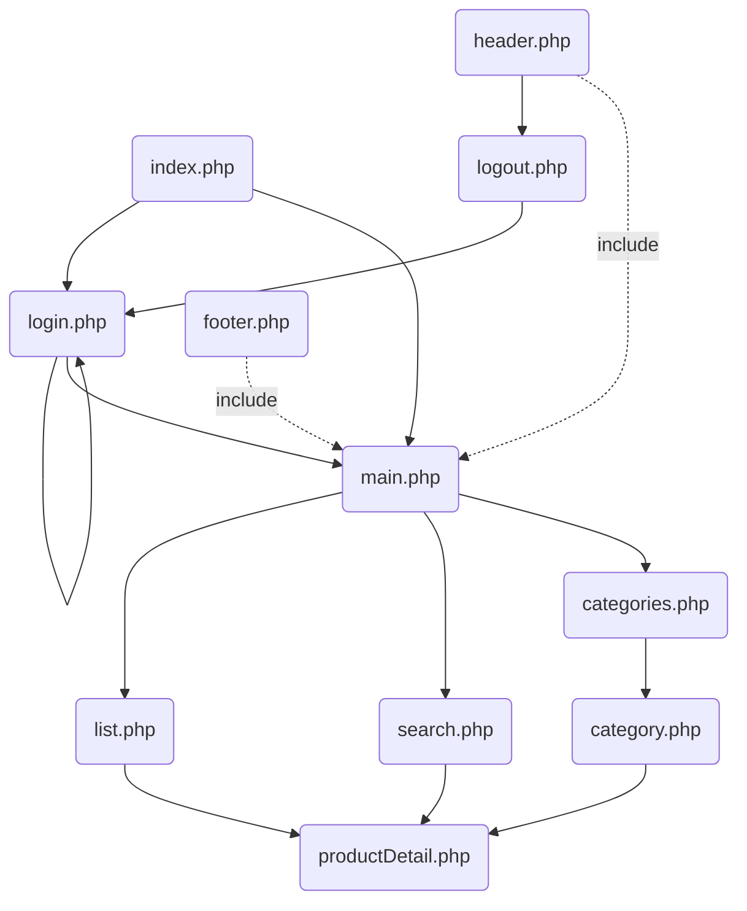

Vamos usar o modelo com o ficheiro de dados que está no projecto github [lsd-db-store](https://github.com/hjneves/lsd-db-store)

## Modelo ER
![[Pasted image 20230516224227.png]]

## Criação do modelos de dados e inserção de dados teste.

Aceder ao repositótio [lsd-db-store](https://github.com/hjneves/lsd-db-store)
Abrir o script no phpMyAdmin e executar.
Após a execucção deverão ser criadas 4 tabelas e inseridos os respectivos dados dummy em cada uma delas.

## SQL e alguns exemplos de queries

- Queries de select 
	 - listagens
	 - contagens
	 - agrupamentos
	 - restrições
- Insert
- Update

```sql
select * from produto;

select count(name) from produto;

select name, price, price*1.23 price_vat from produto;

select name, price, price*1.23 price_vat from produto where price >= 10 and price <=100;

select name, price, price*1.23 price_vat from produto order by price desc;

select name, price, date_created from produto where date_created < now() and month(date_created) = 3;

select name ,price, date_created from produto where name like 'a%';

/*** Joining ***/

select p.name, c.name, c.family, price
from produto p, category c 
where category_id = c.id;

/****  ver categorias sem produtos (utilização subqueries) ***/
// 1º inserir nova categoria - Iluminação, Familia: Montanha
select * from category
where id not in (select category_id from produto);

/*** 2ª opç~ão - usar left Join */
select category.name, produto.name
from category left join produto
on idcategory = category_id

/* Ver encomenda de um user **/
select u.name, p.name, qunatity, price
from user u, produto p, encomenda e
where u.id = e.user_id and p.id = e.produto_id and
e.id = 10;

/* Ver valor da encomenda de um user **/
select u.name, sum(quantity * price)
from user u, produto p, encomenda e
where u.id = e.user_id and p.id = e.produto_id and
e.id = 10;

/**** Ver valor global de cada encomenda ..... com contagens ***/
select u.name, sum(quantity*price), count(produto_id)
from user u, produto p, encomenda e
where u.id = e.user_id and p.id = e.produto_id
group by u.name;

/**** Top 10 produtos mais encomendados ***/
select p.name, sum( quantity) qtd 
from user u, produto p, encomenda e
where u.id = e.user_id and p.id = e.produto_id
group by p.name
order by qtd desc
limit 10;

/***** Lista unica de produtos encomendados +******/
select distinct p.name
from user u, produto p, encomenda e
where u.id = e.user_id and p.id = e.produto_id;

/**** Lista de produto nunca encomendados ******/
select name, produto_id 
from produto p
left join encomenda e
on p.id = produto_id
where produto_id is null;


/** Views ***/

/****  Product list ****/
create view lista_produtos as
select p.name product_name, c.name category, c.family, price
from produto p, category c 
where category_id = c.id;

/***** Top 10 products ******/
create view top10products as
select p.name, sum( quantity) qtd 
from user u, produto p, encomenda e
where u.id = e.user_id and p.id = e.produto_id
group by p.name
order by qtd desc
limit 10;

/**** UPdate da informação do utilizador *****/
update user 
set 
email = 'hjmn@mob.com',
address_street = 'Rua do Jasmim',
address_nr = '8'
where
id = 4;

select name, date_created, adddate(date_created ,-1)
from user;


```

## Organização do site - layout dos ficheiros




Estrutura do doc:
-  Imagem com arquitectura da navegação do site
- Separar header e footer para ficheiros diferentes
	- Include vs require - ambos permitem a inclusão de um ficheiro php mas no primeiro caso apenas da um warning se o ficheiro não existir. No segunda da um erro e termina
- PHP para assinalar página corrente no menu


## Detalhe de produto - productDetail.php

```php
<?php 
    session_start();

      // If there is no session active redirects to login
    if (!isset($_SESSION["email"])){
      Header("Location: login.php");
    }
    // get id product from address bar , method get
    $id = $_GET["id"];
    
    require("connection.php");

    $query = "select idproduct,
	product.name name, 
    photos, 
    price, 
    FORMAT(price*1.23, 2) price_vat,
	category.name category,
    product.dt_created dt_created
    from product, category
    where category_idcategory = idcategory 
    and idproduct = $id";

    $results = mysqli_query($connection, $query);


?>

<!doctype html>
<html lang="en">
  <head>
    <meta charset="utf-8">
    <meta name="viewport" content="width=device-width, initial-scale=1">
    <title>Babs Site</title>
    <link href="https://cdn.jsdelivr.net/npm/bootstrap@5.2.0-beta1/dist/css/bootstrap.min.css" rel="stylesheet" integrity="sha384-0evHe/X+R7YkIZDRvuzKMRqM+OrBnVFBL6DOitfPri4tjfHxaWutUpFmBp4vmVor" crossorigin="anonymous">
  </head>
  <body>

    <?php
        require("header.php");
    ?>

    <div class="container">
            
        <?php
            $row = mysqli_fetch_assoc($results);

                $id =     $row["idproduct"];
                $name =   $row["name"];
                $image =  $row["photos"];
                $price =  $row["price"];
                $price_vat = $row["price_vat"];
                $category = $row["category"];
                $date      = $row["dt_created"];

                echo "<div>";
                echo "<p class='display-3'>$name</p>";
                echo "<p></p>";
                echo "<p>Price: $price € ($price_vat €)</p>";
                echo "<p class='badge bg-secondary'>$category</p>";
                echo "<p>$date</p>";
                echo "</div>";
            

        ?>


    </div>
    
    <?php
        require("footer.php");
    ?>

    <script src="https://cdn.jsdelivr.net/npm/bootstrap@5.2.0-beta1/dist/js/bootstrap.bundle.min.js" integrity="sha384-pprn3073KE6tl6bjs2QrFaJGz5/SUsLqktiwsUTF55Jfv3qYSDhgCecCxMW52nD2" crossorigin="anonymous"></script>
  </body>
</html>
```

## Listagem de produtos - list.php

```php
<?php 
    
    session_start();

      // If there is no session active redirects to login
    if (!isset($_SESSION["email"])){
      Header("Location: login.php");
    }
  
    
    require("connection.php");

    $query = "select idproduct,
	product.name name, 
    photos, 
    price, 
    FORMAT(price*1.23, 2) price_vat,
	category.name category
from product, category
where category_idcategory = idcategory";

    $results = mysqli_query($connection, $query);


?>

<!doctype html>
<html lang="en">
  <head>
    <meta charset="utf-8">
    <meta name="viewport" content="width=device-width, initial-scale=1">
    <title>Babs Site</title>
    <link href="https://cdn.jsdelivr.net/npm/bootstrap@5.2.0-beta1/dist/css/bootstrap.min.css" rel="stylesheet" integrity="sha384-0evHe/X+R7YkIZDRvuzKMRqM+OrBnVFBL6DOitfPri4tjfHxaWutUpFmBp4vmVor" crossorigin="anonymous">
  </head>
  <body>

    <?php
        require("header.php");
    ?>

    <div class="container">
        <h1 class="display-3">Lista de produtos</h1>
    
        <div class="row row-cols-1 row-cols-sm-2 row-cols-md-3">
        <?php
            foreach($results as $row){
                $id =     $row["idproduct"];
                $name =   $row["name"];
                $image =  $row["photos"];
                $price =  $row["price"];
                $price_vat = $row["price_vat"];
                $category = $row["category"];

                echo "<div class='col'>";
                echo "  <p class='fs-6'><a href='productDetail.php?id=$id'>$name</a></p>";
                echo "  ";
                echo "  <p>$price € ($price_vat €)</p>";
                echo "  <p class='badge bg-secondary'>$category</p>";
                echo "</div>";
            }

        ?>
        </div>


    </div>
    
    <?php
        require("footer.php");
    ?>

    <script src="https://cdn.jsdelivr.net/npm/bootstrap@5.2.0-beta1/dist/js/bootstrap.bundle.min.js" integrity="sha384-pprn3073KE6tl6bjs2QrFaJGz5/SUsLqktiwsUTF55Jfv3qYSDhgCecCxMW52nD2" crossorigin="anonymous"></script>
  </body>
</html>
```


