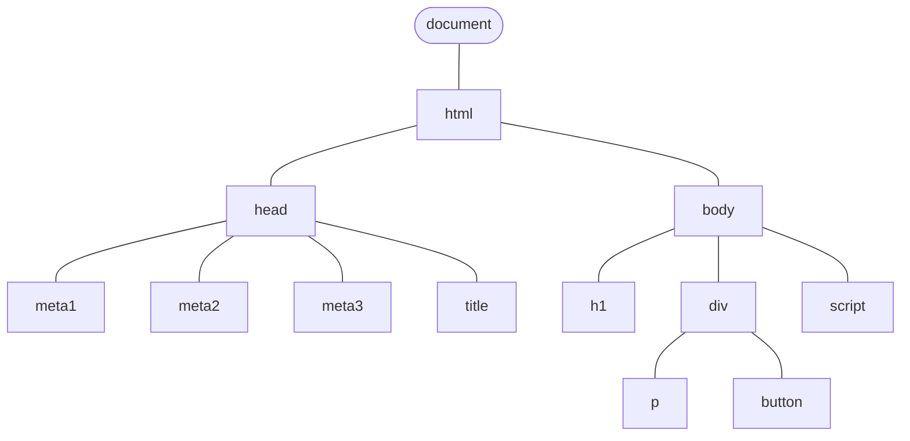

## Introdução

A linguagem de programação javascript está intimamente ligada ao desenvolvimento web, sendo a linguagem que os browsers suportam no desenvolvimento do frontend ao nível das interações e dinamismo.
Sendo os programas executados no browser, é através de javascript que conseguimos por ex. desencadear ou implementar animações numa página, validar campos num formulário, alterar a estrutura ou conteúdo da página, etc.

A componente javascript de uma página web pode ser definidas de várias formas:

### Inline

```html
<button onClick="alert('Hi There');">Submit</button>
```
Neste exemplo estamos a associar ao evento `onclick` de um botão uma função `alert` que vai apresentar uma mensagem Hi there. 
Não é a opção mais recomendada porque, estando embebida no html, a leitura torna-se difícil, e não se pode reaproveitar o mesmo código para outros elementos html.

### Tag script

```html
<script type="text/javascript">
  alert("Hi there");
</script>
```

Neste caso todo o código é executado quando a página é carregada e por convenção é colocado em:
* antes do fecho do `</head>`, ou
* imediatamente antes do fecho do `</body>`

Ainda utilizando a tag `<script`> podemos carregar código javascript de um ficheiro externo.
Neste exemplo vamos carregar o código javascript que estiver no ficheiro `script.js`.
```js
<script src="script.js"></script>
```

## DOM

O javascript para conseguir interagir com uma página web vai ter acesso ao denominado DOM - Document Object Model.
Este modelo é uma representação de todos os elementos presentes numa página numa estrutura em forma de árvore. Inicia com o nó `document`e depois vai ramificando conforme vamos tendo elementos dentro de elementos. 

Exemplificando:
```html
<!DOCTYPE html>
<html lang="en">
  <head>
    <meta charset="UTF-8" />
    <meta name="viewport" content="width=device-width, initial-scale=1.0" />
    <meta http-equiv="X-UA-Compatible" content="ie=edge" />
    <title>About DOM</title>
  </head>
  <body>
    <h1>Hellow World</h1>
    <div>
	    <p>O que é o DOM?</p>
	    <button onClick="alert('Olá');">Submit</button>
    </div>
    <script></script>
  </body>
</html>
```

O código html acima terá uma representação DOM como esta. Inicia como `document`que é um objeto que contém toda a página, este por sua vez tem um `<head>`e um `<body>`.



Através do javascript vamos conseguir:
- alterar o conteúdo de elementos html
- modificar o css de elementos html
- adicionar ou remover elementos html

## Elementos e Eventos

### Elementos
Com o javascript conseguimos  aceder a cada elemento do DOM de uma página programaticamente. O javascript disponibiliza um conjunto de funções para aceder aos elementos de uma página. São funções que identificam os elementos sua tag, id, class ou outros atributos. 

Alguns exemplos:
```js
    document.querySelector(".text") // devolve primeiro elemento com class="text"  
    document.getElementById("box1") // devolve elemento com id="box"
    document.getElementsByTagName("p") // devolve array de elementos com tag p
```

Cada uma destas funções devolve um ou mais elementos html. Depois de acedermos ao elemento com estas funções podemos de alguma forma manipulá-lo. Podemos por exemplo ao elemento com class `.text` alterar o seu conteúdo html com a função `innerHTML`.

Alguns exemplos:
```html
 <p class="text">Some text</p>
 <p>Article 1</p>

  <script type="text/javascript">
  
    // This is a line comment
  
    /*
     This is a multi-line
     comment
    */
    
    document.querySelector(".text").innerHTML="Some more text";
    document.getElementsByTagName("p")[2].innerHTML="Article 1 changed";
    
  </script>
```
Quando esta página for carregada, o seu conteúdo vai ser modificado pelo javascript. O primeiro parágrafo vai ficar com `Some more text` e o segundo com `Article 1 changed`.

>[!tip ] Acesso encadeado
>Ter `document.querySelector(".text").innerHTML="Some more text";`seria equivalente a ter `var elem = document.querySelector(".text")`e depois `elem.innerHTML = "Some more text"`.
>No javascript ser recorrer a variáveis intermédias podemos manipular um objeto que se encontra dentro de outro com recurso ao ponto `.`

### Eventos

Os eventos em javascript são acontecimentos durante a interação com uma página web que podem ser interceptados executando uma função própria, definida por nós.

Um evento normalmente usado é o evento de `onclick`que está relacionado com o click do rato num determinado elemento.
Podemos usar uma função anónima ou uma função normal para associar ao evento.

#### Função anónima

```html
<button id="checkCart">Cart</button>

<script type="text/javascript">

	document.querySelector("#checkCart").onclick=function() {
	  alert("Hi! You have 5 products on the cart");
	}
    
</script>
```

#### Função normal

```html
<button id="checkCart" onclick="validateCart()">Cart</button>

<script type="text/javascript">
    
    // alternative method
    document.querySelector("#checkCart").onclick=validateCart
    
    function validateCart() {
      alert("Hi You don't have any products");
    }

    // arrow function
    const validateCart2 = () => {
      alert("Hi You don't have any products");
    }
    
</script>
```

### Evento onclick

Neste exemplo, vamos usar o evento `onclick`num botão para executar uma função que vai simular o feedback ao utilizador num situação de envio de ficheiro.
```html
<button class="submit">Enviar</button>
<p class="works">Work 1.pdf</p>
<p class="works">Work 2.pdf</p>

<script type="text/javascript">  
document.querySelector(".submit").onclick = function () {
  // get the <p> elements with class works
  let works = document.getElementsByClassName("works")

  // Percorrer o array works
  for (work of works) {
	work.textContent += " (done)"
  }
}
</script>
```

Versão do código anterior mas com recurso a css para formatar a mensagem de enviado
```html
<style>
	span {
		color:green;
	}
</style>

...
<button class="submit">Enviar</button>
<p class="works">Work 1.pdf</p>
<p class="works">Work 2.pdf</p>

<script type="text/javascript">  
document.querySelector(".submit").onclick = function () {
  // get the <p> elements with class works
  let works = document.getElementsByClassName("works")

  // Percorrer o array works
  for (work of works) {
	work.textContent += " (done)"
	work.style.color = "green"
  }
}
</script>
```

### CSS styles

Com javascript também podemos manipular os estilos css aplicados aos elementos. Temos o objecto `style` em todos os elementos a partir do qual chegamos às propriedades css. 

Neste exemplo vamos ter dois botões para fazer o increase e o decrease do tamanho da fonte de uma página html,  alterando a tamanho da fonte do elemento html `documentElement`, que é a base usada para o tamanho dos parágrafos e dos headings 
```html

<button class="inc">Increase</button>
<button class="dec">Decrease</button>
<p>My Portfolio Works</p>

<script type="text/javascript">
  let size = 12;

  document.querySelector(".inc").onclick = function () {
	size = size + 2;
	document.documentElement.style.fontSize = size + "px";
  };

  document.querySelector(".dec").onclick = function () {
	size = size - 2;
	document.documentElement.style.fontSize = size + "px";
  };
</script>

```

>[!tip] Nomenclatura css
>Notar que os nomes das propriedades javascript css não são exatamente iguais aos nomes das propriedades no css. Por exemplo, temos `font-size` em css, e `fontSize` em javascript (sensível às maiúsculas ).

#### Criar 2 temas 

Neste exercício queremos simular a criação de 2 temas para uma página: noite e dia. A mudança de tema é desencadeada através de dois botões e os temas vão modificar apelas a cor de fundo e a cor do texto da página.

```css
    .day {
      color: black;
      background-color: white;
      transition: all 0.5s;
    }

    .night {
      color: white;
      background-color: black;
      transition: all 0.5s;
    }
```

```html
<button class="night">Noite</button>
<button class="day">Dia</button>

<p>My Portfolio Works</p>
<ul>
  <li>Works I've done</li>
  <li>Web Services</li>
  <li>Design Services</li>
</ul>

<script type="text/javascript">
  document.querySelector(".night").onclick = function () {
	document.body.style.backgroundColor = "black";
	document.body.style.color = "white";
  };
  document.querySelector(".day").onclick = function () {
	document.body.style.backgroundColor = "white";
	document.body.style.color = "black";
  };
</script>
```

## Datas

Em javascript as datas devem ser tratadas através de um objeto do tipo `Date`.
Com este objeto vai ser possível efectuar manipulações à datas tais como o cálculo de tempo decorrido e formatar o estilo de data a apresentar.

O objeto Date traz consigo um conjunto de métodos utilitários tais como:

getDate() Get the day as a number (1-31)
getDay() Get the weekday as a number (0-6)
getFullYear() Get the four digit year (yyyy)
getHours() Get the hour (0-23)
getMilliseconds() Get the milliseconds (0-999)
getMinutes() Get the minutes (0-59)
getMonth() Get the month (0-11)
getSeconds() Get the seconds (0-59)
getTime() Get the time (milliseconds since January 1, 1970)

Neste exemplo estamos a atualizar um heading com a data atual. A data atual é obtida criando um objeto Date sem qualquer parâmetro `new Date()`.

```html
 <h2>Dia actual:</h2>
 <h2 id="myDay"></h2>
 <button id="myBtn">Submit</button>

  <script type="text/javascript">
    document.getElementById("myBtn").onclick = function () {
      document.getElementById('myDay').innerHTML =  new Date();
    }
  </script>
```

### Plugin dayjs

Usar o objeto `Date` para trabalhar diretamente com as datas pode ficar muito complexo. 
Para facilitar a manipulação e formato de apresentação das datas é normal usarmos um plugin que já tenha pré-formatado algumas das principais necessidades. O [`dayjs`](https://day.js.org/en/) é um exemplo de pequenino plugin que nos dá essas funcionalidades.

Pode ser instalado através de um CDN
```html
<script src="https://unpkg.com/dayjs@1.11.10/dayjs.min.js"></script>
<script src="https://unpkg.com/dayjs@1.11.10/locale/pt.js"></script>
<script src="https://unpkg.com/dayjs@1.11.10/plugin/localizedFormat.js"></script>
```


Pegando no mesmo exemplo anterior podemos então format a data por exemplo : 4-Nov-2023

```js

 <h2>Dia actual:</h2>
 <h2 id="myDay"></h2>
 <button id="myBtn">Submit</button>

  <script type="text/javascript">
    document.getElementById("myBtn").onclick = function () {
      document.getElementById('myDay').innerHTML = dayjs().format(
"D-MMMM-YYYY";
    }
  </script>
```

O formato `D-MMMM-YYYY`pode ser construído com base no conjunto de [tokens](https://day.js.org/docs/en/display/format) que o dayjs disponibiliza.

## Validação de campos

Por questões de segurança e usabilidade é muito importante efectuar validações aos campos que o utilizador pode preencher com informação. Normalmente são os campos `<input>`e `<textarea>`que necessitam de ser validados olhando para a propriedade `value`.

Ao nível do cliente existem essencialmente dois tipos de validação dos forms: ao nível das tags html com alguns atributos e ao nível do javascript. Mais sobre validação no [cliente](https://developer.mozilla.org/en-US/docs/Learn/Forms/Form_validation).

Por exemplo, ao nível das tags podemos definir um campo de `<input>`como obrigatório:

```html
<input class="qty" type="number" min="0" required />
```
Ao tentarmos submeter um form com este campo de input sem nenhum valor ou com um número menor que 0, vai dar um erro.


Neste exemplo, temos um campo do tipo email para efectuar um registo de email empresarial. 
Estamos a atribuir uma função ao evento `onsubmit` para efetuar a validação dia javascript. Neste caso estamos a verificar se o campo é um email na tag (type email) mas estamos a verificar se está vazio ou se o dominio do email é da LSD.
```html
 <form class="subscribe">
  <p class="status"></p>
  <input class="newsletter" type="email" placeholder="o seu email ..." />
  <button>Registar</button>
</form>

<script type="text/javascript">
  let status = document.querySelector(".status");

  document.querySelector(".subscribe").onsubmit = function (e) {
	let email = document.querySelector(".newsletter").value;
	if (email.trim() === "" || email.search('lsd.pt') < 0) {
	  status.textContent = "Email LSD inválido";
	  e.preventDefault();
	} 
  };
</script>

```

Existem plugins que disponibilizam um conjunto de validações de forms, como por exemplo o  [PristineJS](https://pristine.js.org/demo.html) ou o [Validate](https://rickharrison.github.io/validate.js/).

## Criação elementos

Uma outra possibilidade que temos é a criação de elementos dinamicamente usando javascript.

### Lista dinâmica

Neste exemplo temos a criação de uma lista popup de forma dinâmica. Ela está vazia no ficheiro html, mas vai ser populada em javascript com recursos a uma array com uma lista de cores.
```html

<form>
<p>45€</p>
<p>
  <span>Color</span>
  <select></select>
</p>
<button>Comprar</button>
</form>

```

```js
  let colors = ["green", "blue", "starblue", "light blue"];

  // get select using querySelector
  let select = document.querySelector("select");
  // for each color in array colors
  // - create an option
  // - set color of option with innerHTML
  // - assign option as child of select
  for (color of colors) {
	let option = document.createElement("option");
	option.textContent = color;
	select.appendChild(option);
  }
```


### Lista de comentários

Podemos ter por exemplo um ecrã de produto, onde existe uma secção de comentários. O utilizador pode criar um comentário novo que será adicionado a uma lista de comentários. Neste exemplo vamos necessitar de um input (textarea) para escrever o comentário, mas a criação dinâmica dos elementos será feita com recurso à função `[createElement](https://developer.mozilla.org/en-US/docs/Web/API/Document/createElement)`.
Notar que criar um elemento não significa que ele aparece automaticamente ao utilizador. É necessário também indicar onde vai esse elemento ficar, ligando-o por exemplo a uma `<div>`através por exemplo da função js `appendChild`.

Neste exemplo, temos ainda a validação do input, que caso esteja a vazio, é apresentada uma mensagem de erro.

```html

  <form id="newComment">
	<p>Escreva o seu comentário</p>
	<textarea></textarea>
	<p class="error"></p>
	<p>
	  <button
		type="button"
		class="btn btn-primary"
		onclick="insertComment()"
>
		Inserir
	  </button>
	</p>
  </form>
  <hr />
  <div class="commentList"></div>

<script>
  // my javascript code inside HTML

  function insertComment() {
	console.log("Insert Comment ...");
	// check if textarea is empty
	let textarea = document.querySelector("textarea");

	if (textarea.value.trim() == "") {
	  // show error message
	  document.querySelector(".error").textContent = "Comentário inválido";
	  // add boostsrap alert classes
	  document
		.querySelector(".error")
		.classList.add("alert", "alert-danger");
	} else {
	  // cleanup error message <p>
	  document.querySelector(".error").textContent = "";
	  document
		.querySelector(".error")
		.classList.remove("alert", "alert-danger");
	  // insert comment into comment list

	  // create an <p> element
	  let comment = document.createElement("div");

	  // set <p> element content to user input
	  comment.innerHTML = `<p>${textarea.value}</p>
		  <p class='fw-lighter fst-italic'>${dayjs().format(
			"DD-MMM HH:mm:ss"
		  )}</p>
		  <hr />`;

	  // assign comment to comment List div
	  document.querySelector(".commentList").appendChild(comment);
	}
  }

    </script>
```
